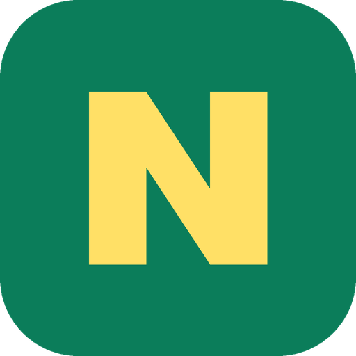
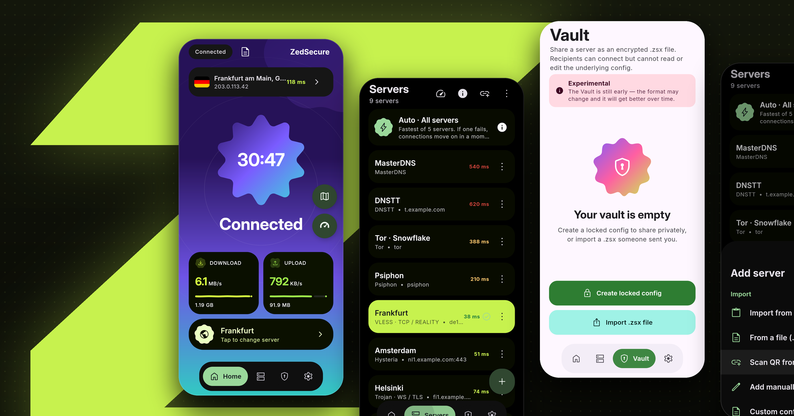

<div dir="rtl">

<p align="center">
  
</p>

<h1 align="center">Narcic Getway</h1>

<p align="center">همهٔ راه‌های عبور، در یک برنامه.</p>

<p align="center">
  <a href="https://github.com/valid7996/Narcic-Getway/releases/latest"></a>
  <a href="https://play.google.com/store/apps/details?id=com.zedsecure.vpn"></a>
  
  <a href="LICENSE"></a>
</p>

<p align="center"><a href="README.md">English</a> · <b>فارسی</b></p>

## Narcic Getway چیست؟

Narcic Getway یک کلاینت VPN و پروکسی برای اندروید، لینوکس، ویندوز و مک است که به‌جای یک هسته، چند هسته
را با هم دارد. وقتی یک مسیر بسته شود، مسیر بعدی از قبل نصب است: Xray و sing-box برای پروتکل‌های
رایج، سایفون و Tor برای وقتی که هیچ چیز دیگری وصل نمی‌شود، تونل DNS برای شبکه‌هایی که جز DNS
تقریباً چیزی رد نمی‌کنند، و WireGuard و AmneziaWG و OpenConnect و IKEv2 برای سرورهایی که خودتان
دارید. هسته‌ها را می‌شود از داخل هم عبور داد، و با یک لمس همهٔ سرورها تست می‌شوند و اتصال روی
سریع‌ترینشان می‌رود.

<p align="center">
  
</p>

## هسته‌ها

| هسته | چه چیزی را حمل می‌کند |
|---|---|
| Xray | VLESS با Reality و Vision و XHTTP، VMess، Trojan، Shadowsocks، Hysteria2، WireGuard، AmneziaWG |
| sing-box | TUIC، Naive، AnyTLS، ShadowTLS، فایل‌های OpenVPN (`.ovpn`) و JSON خودِ sing-box |
| سایفون | شبکهٔ خودِ سایفون؛ سرور شخصی لازم ندارد |
| Tor | پل‌های obfs4 و Snowflake و Conjure |
| تونل DNS | DNSTT، VayDNS و MasterDNS، روی UDP یا TCP یا DoT یا DoH |
| OpenConnect | سرورهای Cisco AnyConnect و سازگارها |
| IKEv2 | کلاینت IPsec داخلی خودِ اندروید |
| SSH | به‌تنهایی، یا از داخل هر کدام از بالایی‌ها |

اندروید همه را دارد. لینوکس و ویندوز و مک، Xray و sing-box و تونل‌های DNS و SSH را دارند.

## امکانات

- وارد کردن لینک، اشتراک، JSON خودِ Xray و sing-box، فایل `.ovpn`، لینک `vpn://` امنزیا و کد QR
- انتخاب خودکار: تونل را روی سریع‌ترین سرور نگه می‌دارد و اگر قطع شد خودش جابه‌جا می‌کند
- زنجیره در هر دو جهت، مثلاً Xray از داخل Tor یا Tor از داخل Xray
- مسیریابی برای هر برنامه، ویرایشگر قوانین geoip/geosite، و SNI spoofing روی گوشی‌های روت‌شده
- Vault: کانفیگ را به‌صورت فایل `.zsx` به اشتراک بگذارید تا بدون نمایش محتوا وصل شود، با رمز و تاریخ انقضای اختیاری
- تست سرعت، یافتن MTU، اسکنر DNS و لاگ زنده
- طراحی Material 3 Expressive، روشن و تاریک، به فارسی، انگلیسی، روسی و چینی

## دانلود

**اندروید:** از [گوگل پلی](https://play.google.com/store/apps/details?id=com.zedsecure.vpn)، یا
APK مخصوص دستگاهتان از [Releases](https://github.com/valid7996/Narcic-Getway/releases/latest)
(`arm64-v8a` برای تقریباً همهٔ گوشی‌ها، `armeabi-v7a` برای گوشی‌های قدیمی‌تر).

**لینوکس:** فایل `.deb`، `.rpm`، `.AppImage` یا `.tar.gz` از Releases. روی NixOS:
`nix run github:valid7996/Narcic-Getway`

**ویندوز:** نصب‌کنندهٔ `.msi`، یا نسخهٔ قابل حمل `.zip`.

**مک:** فایل `.dmg` برای Apple Silicon یا Intel. برنامه notarize نشده، پس بار اول با راست‌کلیک و
سپس Open بازش کنید.

## ساخت از سورس

<div dir="ltr">

```sh
./tools/fetch-cores.sh           # every engine at its pinned commit
./tools/build-zedcore.sh         # the Android core; needs Go 1.26.3 and NDK 28 or newer
./gradlew :app:assembleRelease   # three APKs, one per ABI
./gradlew :desktop:packageDeb    # or packageRpm, packageMsi, packageDmg
```

</div>

هسته‌هایی که تغییر داده‌ایم به‌صورت فورک منتشر شده‌اند؛ در
[`tools/core-sources.txt`](tools/core-sources.txt) هر کدام با کامیت دقیقی که هر نسخه از آن ساخته
می‌شود آمده است. زدن تگ `v*` نسخهٔ اندروید و همهٔ نسخه‌های دسکتاپ را در CI می‌سازد و همه را در
یک ریلیز می‌گذارد؛ اندروید و دسکتاپ یک شمارهٔ نسخه دارند.

## سپاسگزاری

حالت‌های DNSTT و VayDNS تونل DNS با کتابخانهٔ [VayDNS](https://github.com/net2share/vaydns)
ساخته شده‌اند که فورکی از [dnstt](https://www.bamsoftware.com/software/dnstt/) است. حالت MasterDNS
موتور جداگانه‌ای است که پایین‌تر از آن نام برده شده.

ایده‌های اصلی این تونل از [SlipNet](https://github.com/anonvector/SlipNet) ساختهٔ anonvector
آمده است: DNS روی TCP ساده (که VayDNS به‌تنهایی ندارد)، حالت‌های رزالور fan-out و round-robin
همراه با تعداد پخش، استخر DNS که در هر اتصال سریع‌ترین رزالورها را انتخاب می‌کند، تنظیمات
override سراسری رزالور و جلوگیری از fallback ی DNS، و طراحی و متن تنظیمات DNS و SSH.

نسخه‌های پیش از 3.0.9 موتور خود SlipNet، از جمله لایهٔ انتقال TCP آن، را داخل هسته داشتند. از
نسخهٔ 3.0.9 موتور `zeddns` است که برای همین اپ نوشته شده؛ همان قابلیت‌ها را دارد، اما با کد
خودش.

Narcic Getway همچنین روی
[Xray-core](https://github.com/XTLS/Xray-core)، [sing-box](https://github.com/SagerNet/sing-box)،
[سایفون](https://github.com/Psiphon-Labs/psiphon-tunnel-core)، [Tor](https://www.torproject.org/)،
[MasterDnsVPN](https://github.com/masterking32/MasterDnsVPN)،
[AmneziaWG](https://github.com/amnezia-vpn/amneziawg-go)،
[OpenConnect](https://www.infradead.org/openconnect/)،
[hev-socks5-tunnel](https://github.com/heiher/hev-socks5-tunnel) و
[zeptun](https://github.com/Noisemux/zeptun) بنا شده است. لایسنس هر کدام در
[NOTICE](NOTICE) آمده است.

## لایسنس

[AGPL-3.0](LICENSE). هستهٔ برنامه sing-box و سایفون و sing-openvpn را هم لینک می‌کند که GPL-3.0
هستند؛ بند ۱۳ لایسنس GPL-3.0 ترکیب آن‌ها با کد AGPL-3.0 را اجازه می‌دهد و هر بخش لایسنس خودش را نگه می‌دارد.

</div>
